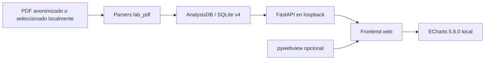
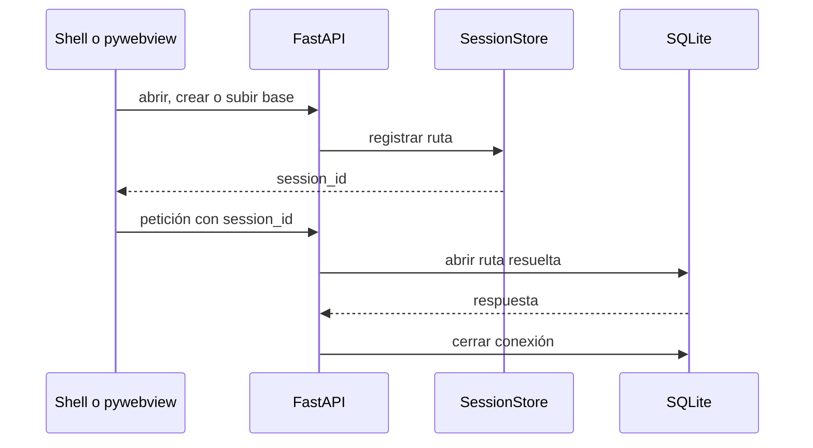

# Arquitectura

## Visión general

Análisis SACYL es una aplicación local. FastAPI sirve la API y el frontend; pywebview puede alojar la misma interfaz en una ventana nativa. Conceptualmente, cada archivo SQLite contiene la historia longitudinal de un paciente.

## Runtime y recursos

`app.web_main` reserva un puerto libre en `127.0.0.1`, espera una respuesta real de `/health` y gestiona el cierre del servidor. `ANALISIS_SACYL_PORT` permite fijar un puerto válido. Los modos son browser, desktop y smoke test; importar o ejecutar browser no requiere pywebview.

Los recursos web son de solo lectura. En un bundle PyInstaller se resuelven desde `sys._MEIPASS`; las escrituras nunca se dirigen allí. ECharts se carga desde `web/assets/vendor/echarts-5.6.0.min.js`, sin CDN.

## Datos y sesiones

La raíz escribible se selecciona en este orden:

1. `ANALISIS_SACYL_DATA_DIR`;
2. `SALUD_V1_DATA_DIR`, por compatibilidad;
3. `~/.analisis-sacyl`.

PDFs subidos, bases subidas y temporales usan directorios separados. Las bases escogidas o creadas explícitamente conservan su ruta. `SessionStore` mantiene únicamente rutas, bajo lock; cada petición abre y cierra su propia conexión. Las sesiones son locales al proceso, no persisten ni expiran automáticamente.

## Importación

`lab_pdf` extrae paciente, metadatos, hematología, bioquímica, gasometría y orina. La API admite rutas locales y uploads multipart. Cada PDF se aplica en una transacción: ante un error se revierte la unidad completa. Los uploads reciben nombres internos, se confinan a su directorio y se limpian; los errores externos se sanitizan.

## SQLite

El esquema canónico tiene versión 4 en `PRAGMA user_version`. La preparación clasifica el esquema, rechaza bases futuras, extranjeras o incoherentes y migra únicamente esquemas reconocidos. Antes de una adopción o migración crea y verifica un backup junto a la base.

`MIGRATIONS` continúa vacío: no existen migraciones futuras registradas ni debe inferirse una historia de versiones no acreditada. Las tablas clínicas referencian `analisis`, y la identidad básica de una analítica sigue basada en fecha y número de petición.

## API y frontend

Los routers cubren salud, sesiones, importación, paciente, series, rangos, histogramas proxy, límites, tratamientos, ingresos y timeline. El frontend mantiene pestañas por sesión y ofrece gráficas, KPIs, zoom y modales. Los rangos editables continúan globales y en memoria.

RBC, PLT y WBC son representaciones proxy derivadas de valores agregados; no son datos directos del analizador ni información diagnóstica.

## Build y legado

`AnalisisSACYL.spec` genera un bundle Windows onedir sin consola e incluye el frontend local. `scripts/build_windows.sh` valida el entorno antes de construir y ejecutar el smoke test. El workflow Windows instala perfiles limpios, prueba, inspecciona y publica `AnalisisSACYL-windows`.

`ranges/dialog.py`, `lab_pdf/text_norm.py` y algunas nomenclaturas `salud_v1` permanecen como legado controlado. No forman una arquitectura alternativa activa.
